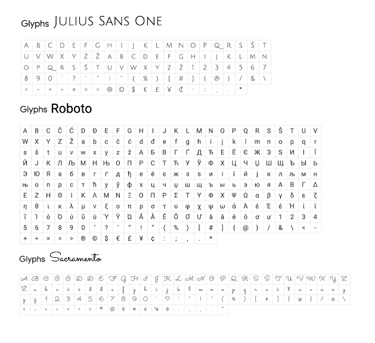
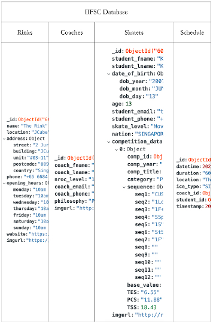

## Code Institute Milestone Project 3 - Python and Data Centric Development

### IIFSC Database

This project aims to provide support to users as a centralized community resource database. Parents, students and coaches new to Singapore Figure Skating community will benefit the most from being able to connect with fellow skaters and coaches. Current community individuals will also benefit from easy to access buttons for their monthly ice time booking with SISA as well as sourcing for gear replacement and blade sharpening. Some may even store their individual competitive datasets for comparisons and analysis. As a site owner, IIFSC can potentially gain traction as the premier figure skating club in singapore supporting both recreational and competitive skaters with an ecosystem to develop more competitive skaters at the international stage for Singapore. Data collection from the community will also help IIFSC identify unmet needs within the current community.  

#### Island Ice Figure Skating Club (IIFSC) - Background
  
Island Ice Figure Skating Club is a social ice skating club formed to provide support to our figure skater members and families. IIFSC focuses on building rapport, camaraderie and harmony within the ice skating community by initiating and organizing a variety of activities that promotes such values through fun/play. IIFSC believes that it takes a village to raise a child and aims to create a strong tribe to support each and every individual skater (and family) to reach their individual skating goals. IIFSC logo represents the blades and scratch lines made when a figure skater draws/cuts an image on ice. Both blades were chosen in pink and blue to signify gender neutrality whislt one being larger than the other as a representation of a parent/educator/coach and child/student.

IIFSC is also the home club for a number of Singapore's National Squad team members.

### UX - User Experience

Wireframe of the build design includes:

 

 BLUE denotes stability, balance, and harmony  
 RED symbolizes power and energy. PINK symbolizes unconditional love and support  
 YELLOW is associated with spontainety and flexibility  
 BLACK symbolizes elegance and sophistication  

 

Colors & Font families selected for UI/UX is consistent with IIFSC's brand image and values.

A demo of the site can be found here [iifscdb.herokuapp.com](iifscdb.herokuapp.com)

IIFSC Database schema

## Built With 
### Technologies
1. HTML 5.0 + CSS as core language for frontend UI + Jinja template.
2. Bootstrap 5.0 - CSS & JS [https://getbootstrap.com/](https://getbootstrap.com/)
3. Python 3 + Flask [https://www.python.org/](https://www.python.org/) and [https://flask.palletsprojects.com/](https://flask.palletsprojects.com/) as core language for backend processing.
4. MongoDB Atlas [https://www.mongodb.com/cloud/atlas/](https://www.mongodb.com/cloud/atlas) as database handler.
5. Cloudinary [https://cloudinary.com/](https://cloudinary.com/) for image hosting of uploaded image files.
6. Heroku [https://www.heroku.com/](https://cloudinary.com/) as deployment host.

### Styling
1. Google Fonts [https://fonts.google.com/](https://fonts.google.com/) for font-family pairings.
2. Fontawesome [https://fontawesome.com/](https://fontawesome.com/) for icons.
3. Gimp 2.10 [https://www.gimp.org/](https://www.gimp.org/) for image manipulation.
4. Adobe Color [https://color.adobe.com/](https://color.adobe.com/) to extract IIFSC base color chart.

### Testing
[W3C Validator](https://validator.w3.org/) for html validation. All errors dealt with save for Jinja templating errors/ warnings.

[Jigsaw CSS Validator](https://jigsaw.w3.org/css-validator/) for css validation. no errors found.

| Action (development testing)             | Results                       | Status      |
| -----------------------------------------|:-----------------------------:|-------------|
| Form submissions - empty form            | Alert prompts fixed           | Completed   |
| Form submissions - invalid data          | Alert prompts fixed           | Completed   |
| Form validation algorithm                | Errors fixed                  | Completed   |                         
| Algorithm testing (datetime, calc)       | Errors fixed                  | Completed   |
| Mongodb CRUD tests                       | Errors fixed                  | Completed   |         
| All buttons and links                    | Corrected paths               | Completed   |
| Responsive pages                         | non-responsive elements fixed | Completed   |

| <h3>**User Features Tests during development**                                                                                                                                                                                                                                                                                                                                                                                                                                                                                               |
| :------------------------------------------------------------------------------------------------------------------------------------------------------------------------------------------------------------------------------------------------------------------------------------------------------------------------------------------------------------------------------------------------------------------------------------------------------------------------------------------------------------------------------------------- |
| **Test 1: Hyperlinks of navigation tabs / hamburger dropdowns with multiple screen size.**                                                                                                                                                                                                                                                                                                                                                                                                                                                   |
| **Expected:** 1. Navbar brings me to different specified pages with external links opening in a new tab. 2. Navbar turns to hamburger dropdown when screensize drops.   **Test:** Clicking on all different links to reload multiple times.  **Result:** Multiple issues with background image for different screen size noted; navigation controls works as expected.                                                                                                                                                            |
| **Test 2: Coaches & Students pages.**                                                                                                                                                                                                                                                                                                                                                                                                                                                                                                        |
| **Expected:** On load, pages should list individual profile cards with profile image and basic data of coaches/students in the database complete with edit+delete icons; newest entry first. **Test:** Click on buttons located in index page or from navbar; adding new entry into database with form.  **Result:** Pages loads & reloads as expected.                                                                                                                                                                          |
| **Test 3: Requests page.**                                                                                                                                                                                                                                                                                                                                                                                                                                                                                                                   |
| **Expected:** On load, a list of lesson request will appear in a table format with detail+delete icons.   **Test:** Click on buttons located in index page or from navbar; adding new entry into database with form.  **Results:** Page loads as expected; however, table does not support screen rezising for responsive UI/UX noted. Fixed with mediascreen breakpoints                                                                                                                                                              |
| **Test 4: Rinks page.**                                                                                                                                                                                                                                                                                                                                                                                                                                                                                                                      |
| **Expected:** On load, rinks detail card will appear with visit website button.  **Test:** Click on link from navbar.  **Results:** Page loads as expected.                                                                                                                                                                                                                                                                                                                                                                            |
| **Test 5: MongoDB CRUD tests for Coaches + Lesson Requests(schedule) collections.**                                                                                                                                                                                                                                                                                                                                                                                                                                                          |
| **Expected:** Data entry/updates of new coaches and lesson requests via forms uploads into MongoDB and translated into a card entry in coaches page/lesson request submission in requests page with redirects. On cick of delete icon, users will be asked to confirm delete and entry removed from mongoDB database collection.   **Test:** Click btn(Add New) coach + btn(Request Lesson) to add new entries via forms, click on edit/delete icons to update or delete.  **Results:** Multiple errors with datatypes noted. Fixed    |
| **Test 6: MongoDB CRUD tests for Students (+ embed data of historical competition results) collections.**                                                                                                                                                                                                                                                                                                                                                                                                                                    |
| **Expected:** Data entry/updates of new students and competition data via forms uploads into MongoDB and translated into a card entry in students page/competition data in skater's individual profile page with redirects. On click of delete icon, users will be asked to confirm delete and entry removed from mongoDB database collection.   **Test:** btn(Add New) student + btn(More Info) to add new entries via forms, click on edit/delete icons to update or delete.  **Results:** Issues with datetime inputs noted. Fixed  |                                                                                           
| **Test 7: Database search on all pages.**                                                                                                                                                                                                                                                                                                                                                                                                                                                                                                    |
| **Expected:** Listing of only data matching entry of searched criteria.   **Tests:** input criteria and click search.  **Results:** As expected.                                                                                                                                                                                                                                                                                                                                                                                       |                                                                                                                                                                                                                                                                                        
| **Test 8: Validation of forms**                                                                                                                                                                                                                                                                                                                                                                                                                                                                                                              |
| **Expected:** Form will display error message if unable to process forms.   **Tests:** submission of blank form or invalid data patterns; submission uploads of unsupported filetype. **Results:** Multiple failures noted with datetime and file upload inputs. Fixed                                                                                                                                                                                                                                                                 |                                                                                                                                                                                                                                                                                        
| **Test 9: Algorithm validation.**                                                                                                                                                                                                                                                                                                                                                                                                                                                                                                            |
| **Expected:** Datetime manipulation / age calcalations to be on point. Lesson requests must have 48hours lead time. DOB entry will only accept 3 < students aged < 80.    **Test:** submission of multiple combination of dates for students date of birth for age calculations and date and time for lesson requests.  **Results:** Error in original rstrip expression caused all calculation ending with "0" to drop by base 10. Fixed                                                                                              |         
| **Test 10: Error413.**                                                                                                                                                                                                                                                                                                                                                                                                                                                                                                                       |
| **Expected:** Error413 - Entity too large   **Tests:** Uploads of image with file size over app configuration of MAX_CONTENT_LENGTH presets.   **Results:** Errorhandler 413 fails occassionally with server reset during developement. A more elegant way of dealing with this error is required.                                                                                                                                                                                                                                     |                                                                                                     

**User Features Testing (HEROKU Deployment)**  
[Heroku Deployment User Tests detailed documentation](static/assets/docs/DeployedUserTesting.pdf)

## Features
### Existing Features
1. IIFSC IG link for users to catch up on recent happenings
2. "IIFSC" to reload landing page
3. Carousel of images on landing page to promote our skaters & coaches
4. Call to Action Button on landing page supported with Navbar links across pages
5. Collapsible Navlink into hamburger dropdown on small screen width
6. Responsive design for multiple sizes as well as portrait / landscape view
7. Buttons and links to external suppliers opens in new tab
8. Search bar for all listings
9. CRUD framework for Coaches and Skaters collection being core entities - delivered via forms for uploads and profile cards and pages for display.
10. Alert for confirmation of data removal from database

### Features left to Implement
1. Login / Logout for users to secure and protect privacy and datasets.
2. Privacy option setting for profile display.
3. Lesson requests viewable only to individual students and coaches.
4. Flask-mail trigger for lesson requests.
5. Skater's profile with their stories - every program is an art with a reason why; upload of skate video.
6. Glossary for figure skating jargon
7. Library for SISA etiquette, code of conduct and community guidelines
8. Newsflash for event happenings

## Deployment
Steps taken to deploy on HEROKU:  
1. Created account on Heroku.com and verified details /emails.
2. Logged into Heroku via bash
3. Created heroku app.
4. Checked git remote to confirm repo connection.
5. Installed gunicorn package dependency.
6. Created Procfile for heroku with web gunicorn <app>:app
7. Created requirements.txt
8. Git add, commit and push to origin (as heroku prep) followed by git push heroku for app build.
9. Set config vars on heroku.
10. Test deployment.

## Credits
1. [https://docs.python.org/3/library/datetime.html#timedelta-objects](https://docs.python.org/3/library/datetime.html#timedelta-objects) and [https://www.guru99.com/date-time-and-datetime-classes-in-python.html](https://www.guru99.com/date-time-and-datetime-classes-in-python.html) for datetime and timedelta pointers.
2. [https://flask-pymongo.readthedocs.io/en/latest/](https://flask-pymongo.readthedocs.io/en/latest/) and [https://jinja.palletsprojects.com/en/2.11.x/](https://jinja.palletsprojects.com/en/2.11.x/) for clarity in Flask+Python+MongoDB and Jinja templating with HTML.
3. [https://blog.miguelgrinberg.com/post/handling-file-uploads-with-flask](https://blog.miguelgrinberg.com/post/handling-file-uploads-with-flask) and [https://code-maven.com/python-seek](https://code-maven.com/python-seek) for notes on file validation.
4. anon avatar extracted from [https://www.seekpng.com/ima/u2w7i1y3y3i1r5i1/](https://www.seekpng.com/ima/u2w7i1y3y3i1r5i1/) on 21 March 2021.
5. IIFSC for the continous support and access to materials.